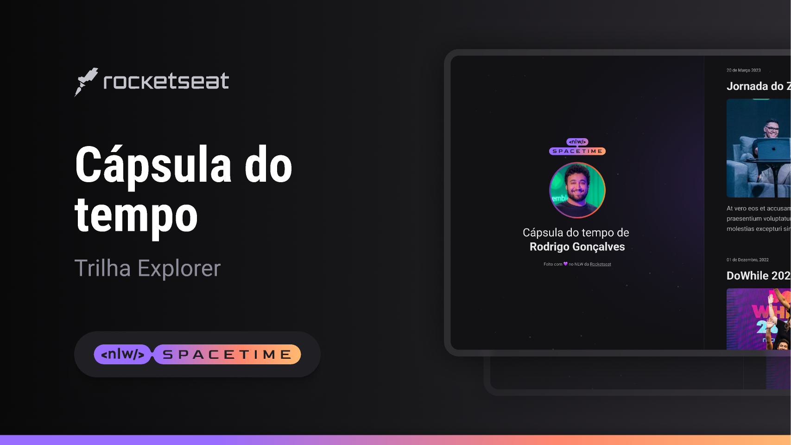

  

<!-- subindo imagem pro github no doc README, pelo git -->

## 🖥️ Projeto

<!-- ## comando markdown(.md) semelhante ao "h2", #="h1", etc -->

Esse é um projeto Web responsivo de uma cápsula do tempo para exibir memórias em uma linha do tempo.

## 🚀 Tecnologias

Esse projeto foi desenvolvido durante o NLW da Rocketseat com as seguintes tecnologias:

- HTML
- CSS
- Git e Github

## 🏷️ Layout

Você pode visualizar o layout do projeto através
[desse link](https://www.figma.com).

<!-- criando link genérico em um texto -->
